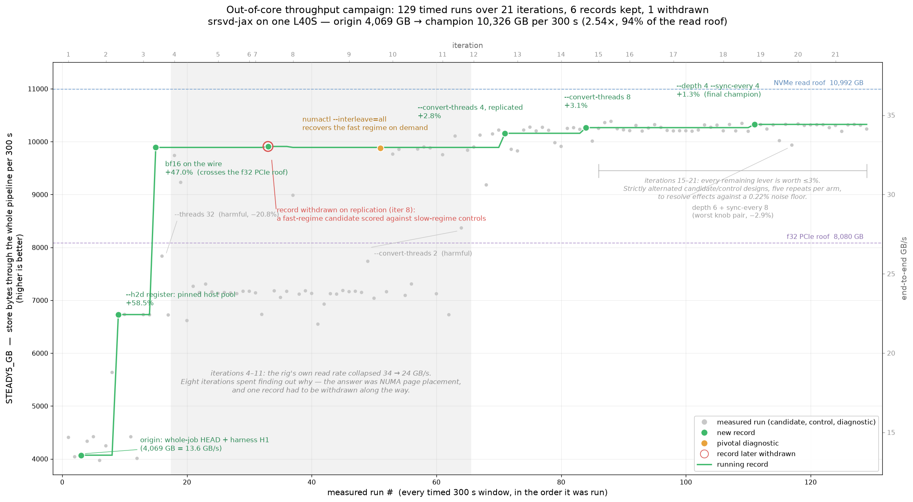

# Running a goal campaign

A goal campaign is Claude Code's `/goal` loop running against a written
contract. The main agent works in iterations. Each iteration it delegates to a
few subagents, and it stops when every checkable end state is met.

## What `/goal` does

`/goal` is a built-in Claude Code command that runs Claude in a while loop:

```
/goal <condition>

while judge(condition, conversation) == "not yet met":
    Claude works another turn
```

You write the condition in plain English:

```
/goal all tests in tests/ pass and the README documents the new flag
```

Normally Claude stops when it decides a task is done. With a goal set, a
second model decides instead. After each turn, Claude Code sends the
condition and the conversation so far to a small, fast model (Haiku by
default). This judge returns one of three verdicts, each with a short reason:

- **Not yet met:** Claude starts another turn and uses the reason as
  guidance.
- **Met:** the goal clears and the loop ends.
- **Impossible:** the goal clears and the reason is recorded.

A real "not yet met" reason, from a campaign:

> Seven of eight done_when conditions are met [...]. The eighth condition
> [...] is not met.

The judge does not call tools. It can't open files or run commands, so it
can only judge what Claude has printed in the conversation. This is why a
goal campaign prints its progress every turn. The ledger file on disk holds
the full record, but the judge never reads it. It reads the short ledger
digest that Claude prints at the end of each turn. Everything printed costs
the main model output tokens and stays in its context, so the digest is kept
to one line per iteration.

`/goal clear` stops a goal early. If a subagent or background command is
still running when a turn ends, the judge waits and checks at the end of a
later turn. Details are in the [Claude Code docs](https://code.claude.com/docs/en/goal).

## Getting started

What you need:

- Claude Code with `/goal`
- the [`/make-goal`](https://github.com/carbonscott/make-goal) skill, which
  turns your prompt into the contract
- optionally, the templates in this repo:
  [goal-casts](templates/goal-cast/) and the
  [delegation guard](templates/delegation-guard.md)

Install `/make-goal`:

```bash
git clone https://github.com/carbonscott/make-goal
mkdir -p ~/.claude/skills/make-goal
cp make-goal/SKILL.md ~/.claude/skills/make-goal/SKILL.md
```

The guide climbs four levels. Start at level 0 and add a layer only when the
campaign needs it.

| Level | You add | Use it when |
|---|---|---|
| 0 — minimal | a goal and a budget | the work fits on one machine and one page |
| 1 — resource pointers | resource pointers: hosts, data, services, prior work | agents must reach things they cannot discover |
| 2 — goal-cast | named roles per iteration | results need checking, not just producing |
| 3 — delegation guard | a watchdog for subagents | many agents or long batch jobs run at once |

---

## Level 0 — minimal

A minimal campaign has three parts:

1. `/goal`
2. a prompt that states the goal
3. a budget as two ranges: **X agents per iteration** (e.g. 2–4) and
   **Y iterations** (e.g. 3–9)

The budget is given as ranges so the main agent can choose within them as it
learns more during the campaign.

### Step 1 — write the contract

Run `/make-goal` in **plan mode** (shift+tab). Plan mode explores the project
before drafting, so the contract uses what is already there.

State the budget and the delegation tool yourself. If you leave them out,
`/make-goal` falls back to its defaults: 2–5 agents per iteration, 3–9
iterations, and the Agent tool.

A real level-0 prompt, from a literature survey that met its goal in 3
iterations:

```
/make-goal i have a loose goal of knowing the areas of interests in quantum
material research.  you have access to @.externals/preprint_servers.json.
Please work on reseaching these preprints [...].  You should work in
iterations, and the budget is 3-9 iterations.  You can use 4-8 subagents
(opus 5.5 at medium) per iteration, and launch them using Workflow tool over
Agent tool.  The whole exploratory happens inside @quantum-materials/
```

Why "Workflow tool over Agent tool": the Agent tool can set only the model.
Reasoning effort ("at medium", "xhigh") can be set only through Workflow.

`/make-goal` interviews you for anything missing, then shows a draft. Nothing
is written until you approve. It writes three files:

- `.goal/<slug>.json` is the contract. Its key part is `done_when`, a list of
  end states. Each one carries its own proof. From the example above:

  > Every cited preprint ID is real, proven by printing the final-turn output
  > of `python quantum-materials/verify_citations.py`, showing [...]
  > `cited IDs: N | found in corpus: N | missing: 0` with N ≥ 18.

- `.goal/<slug>.ledger.json` gets one entry per iteration: what was
  delegated, and what is new.
- `.goal/<slug>.claims.json` holds the campaign's key claims, each tagged
  `verified`, `inherited` or `inferred`.

The `/goal` evaluator reads only conversation text. It cannot open files. So
every end state must be something the agent prints. The ledger digest printed
each turn is what makes your iteration range enforceable.

### Step 2 — run it

Start from a clean context and paste the command `/make-goal` printed:

```
/clear
/goal work until all done_when conditions are met in @.goal/<slug>.json
```

### Step 3 — read the result

Open the claims file and read the `inferred` and `inherited` claims first.
Those are the ones nobody re-checked.

Level 0 is enough for most work. Of the author's first 18 campaigns, 17 used
nothing more and met their goal.

---

## Level 1 — resource pointers

### What a resource pointer is

A resource pointer is a file of checked facts about where things are and how
to reach them. It covers things like remote hosts, cluster accounts,
data locations, service APIs, logs, and the commands that read them. You
reference it with `@file` in the prompt, and every agent can read it when it
needs to.

### Why it helps an autonomous run

- **No one is there to ask.** During a campaign you are not in the loop. Any
  fact the agent lacks becomes a guess, or an iteration spent finding it out.
- **Subagents start cold.** Each subagent begins with no context. A pointer
  file gives every one of them the same map in a single read.
- **It carries over.** Cluster and data facts rarely change between
  campaigns. Write them once, check them once, and reuse the file.
- **It keeps the prompt about the goal.** Facts that don't change live in the
  file. What is specific to this campaign stays in the prompt.

### Examples

Three real pointer files, trimmed. Each is long, so only a few entries are
shown.

**Preprint servers** (`.externals/preprint_servers.json`, from the literature
survey in Level 0). For each server: which API to call, what format it
returns, and how often it may be called.

```json
{
  "notes": [
    "Endpoints change. Run a health check (one small request per endpoint)
     before relying on this file in production.",
    "Respect each server's terms of use and rate limits; send a descriptive
     User-Agent with a contact email."
  ],
  "servers": [
    {
      "id": "arxiv",
      "access": {
        "method": "native_api",
        "search_api": "https://export.arxiv.org/api/query?search_query=all:{query}&start=0&max_results=50",
        "search_api_format": "Atom XML",
        "auth_required": false,
        "rate_limit_note": "Roughly one request every 3 seconds; see API terms of use."
      },
      "materials_science_categories": ["cond-mat.mtrl-sci", "cond-mat.soft", "cond-mat.supr-con"]
    },
    {
      "id": "biorxiv",
      "access": {
        "rate_limit_note": "No keyword search endpoint; the API lists by date
          range or DOI. Use Europe PMC or OpenAlex for keyword search."
      }
    }
    [... 20+ more servers ...]
  ]
}
```

**Beamline resources** (`xpp-resources.json`, from an investigation of a
detector incident).
Which command to trust, and which obvious shortcut gives the wrong answer.

```json
"how_many_events_did_run_N_have": "NOT ANSWERABLE FROM ANY LOG ON THIS
  HUTCH. Verified absent. Use the eLog (skills.elog_search). [...]",

"find_the_current_experiment": "`get_curr_exp -i xpp` -- verified working
  standalone, returned xpp102087827 on 2026-09-20. USE THIS, not directory
  mtimes: `ls -dt [...]/xpp1*` puts xpp101921427 first [...] even though the
  active experiment was xpp102087827 -- directory mtimes on XPP are
  misleading."
```

**Cluster facts** (`s3df.setup.json`, from the srsvd-jax campaigns). How to use
the batch system without losing a hard-won allocation.

```json
"submission_pattern": "Hold the allocation once with `salloc --no-shell`, then
  drive steps into it with `srun --jobid=<id>` as many times as needed -- a
  failed step is another srun, never a re-queue. [...] Do NOT use sbatch, and
  do not drop and re-request the allocation between retries."
```

All three say when or how each fact was checked, and name the wrong move as
well as the right one. An entry like "NOT ANSWERABLE [...] Verified absent"
saves an agent from spending an iteration searching for something that isn't
there.

Write facts you have checked, and say when you checked them. Agents act on
these files without questioning them. So a stale path costs a whole
iteration.

### Pointing to resources in the prompt

Reference a pointer file with `@file` anywhere in the prompt, and say what it
is for:

```
We did diagnosis based on the resource pointers in @xpp-resources.json and
produced a report in @xpp-epix100-incident-2026-09-21.html.
[...]
The orchestrator agent should have access to @xpp-resources.json, these are
the resource pointers.
```
*From the detector incident investigation, which met its goal.*

```
You need information about the remote login nodes (which can connect you to
compute nodes through slurm), and it's in @.ai/s3df.setup.json.
```
*From the two-node srsvd-jax campaign.*

You can also ask the campaign to build its own pointer file as it goes. The
single-node throughput campaign asked for one, and the agents kept
`<slug>.setup.json` up to date. They moved each fact from `inherited` to
`verified` once they had checked it on the node.

```
You need to collect setup information you need to run the campaign - remote,
remote storage (wekafs, nvme, etc), bridge, slurm, data.  Data can be
artificially generated on disk.
```
*From the single-node srsvd-jax campaign (the worked example in Level 3).
"Bridge" is [cc-bridge](https://github.com/carbonscott/cc-bridge), the
author's tool for working on remote hosts over SSH.*

Two more inputs are worth pointing to in the prompt:

- A **handoff doc** from an earlier session. For example, "read
  .ai/handoffs/merge-dist-harness-to-main.md".
- An **earlier contract**, when this campaign continues one. For example,
  "We have done a good campaign associated with
  @../runtime-b/.goal/srsvd-ooc-throughput.json."

---

## Level 2 — goal-cast

A goal-cast gives each iteration a fixed shape: named roles, each with a
model, an effort level, and a cadence. Paste it after your goal. Fill in the
`[slots]` and delete any role you don't need.

| Cast | Use when | Example in this guide |
|---|---|---|
| [advisor-worker](templates/goal-cast/advisor-worker.goal_cast.md) | general default: plan, do, then attack the result | the trimmed cast below |
| [implementer-runner](templates/goal-cast/implementer-runner.goal_cast.md) | a number is the goal, measured against a champion | the srsvd-jax campaign (Level 3) |
| [reviewer-fixer](templates/goal-cast/reviewer-fixer.goal_cast.md) | a PR must reach a clean review | landing a PR, below |

### Advisor-worker

The shape, trimmed (see the file for the full text):

```
<goal-cast>
<orchestrator>
You are the orchestrator. Each iteration: think, decompose, delegate,
integrate, ledger. Every decision is yours — advisors advise [...]
Prefer the Workflow tool over the Agent tool whenever Workflow is available.
</orchestrator>

<advisor name="planner" model="[fable]" effort="[xhigh]"
         cadence="iteration 1; any iteration that changes direction [...]">
Consulted BEFORE a decomposition is committed [...] Run a pre-mortem [...]
</advisor>

<advisor name="skeptic" [...] cadence="every iteration that produces a
         measurement or claim">
Consulted AFTER results, BEFORE belief [...] Verdict per claim: BELIEVE, or
QUARANTINE with the reason.
</advisor>

<workers model="[opus]" count="[2-4] per iteration [...]" effort="[xhigh]">
Return evidence, not conclusions [...]
</workers>

<worker name="cold-reader" [...]>
Given the deliverable and NOTHING else [...] attempt to use it end to end.
</worker>

<discipline>
- Predict before you measure [...]
- Quarantine has teeth [...]
</discipline>
</goal-cast>
```

Advisors count toward the per-iteration budget. So an iteration that brings
in the planner and the skeptic has fewer slots left for workers.

### Implementer-runner: beating a performance record

Implementers write candidate changes. One runner measures every candidate next
to the current champion, re-measured in the same iteration. A candidate
becomes the new champion only if it wins by more than the noise floor.

The single-node srsvd-jax campaign used this cast. You can tune a cast for one
campaign without touching the template. Here the user changed the implementer
count and added a setup phase after seeing the draft:

```
- The orchestrator can spend 1-3 iterations to set up the campaign like
  generating data for the campaign on nvme.
- Originally, it's 1 implementer per iteration, but you can have 1-3
  implementers (opus, xhigh) per iterations in case the change is large (do
  not change the base goal cast json, but in the campaign specific goal cast
  json)
- Use 4 bridge session max to mitigate contention from subagents and main
  agent.
```
*From the srsvd-jax campaign in Level 3. The champion reached 2.54× the starting throughput,
at 94% of the one-GPU read limit.*

### Reviewer-fixer: landing a PR

Each iteration a fresh reviewer reads the PR, fixers close the findings in
parallel, and a verifier checks that nothing the tests miss has broken. If
you already use a PR-review skill, name it in the reviewer's `skill` slot;
left as `[none]`, the reviewer follows the plain process in the template.
The prompt can be as short as the goal:

```
/make-goal <main>

you decide how many PRs, but I want to merge them, since we have identified a
champion now.

</main>

<goal-cast>
[reviewer-fixer, slots filled]
</goal-cast>
```
*From a campaign that merged the two-node srsvd-jax benchmark code. In 3
iterations it took the change to an APPROVE verdict from a fresh reviewer.
GitHub won't let an author approve their own PR, so the verdict was posted as
a comment. The user then authorized the merge.*

---

## Level 3 — delegation guard

When many agents run at once, or a worker processes a long list, one looping
agent can cost many times what the rest cost together. In one real case, one
of three sibling agents looped for 1,160 turns, wrote nothing, and cost
~60× what the other two did.

Paste
[`delegation-guard.md`](templates/delegation-guard.md)
after the goal-cast. It tells the orchestrator to:

- **Poll** transcript sizes (not wall-clock time) on a fixed schedule.
- **Question** any agent that is past a size cap or 3× the size of its
  siblings.
- **Stop** agents that are going in circles.
- **Give** every worker a batch size, so an agent that writes no output
  shows up as a failure early.

The part that prevents most problems is the batch rule. Every worker gets it:

```
"Work in batches of about [12] items. For each batch: read the [12], write
 results for every id, and append to [output file] before starting the next
 batch. Never read your whole list before writing anything. [...]"
```

The full level-3 prompt is laid out like this:

```
/make-goal <main>
...goal, budget, "Workflow over Agent", @resource pointers...
</main>

<goal-cast>
...a cast from goal-cast/, slots filled...
</goal-cast>

<delegation-guard>
...delegation-guard.md, slots filled...
</delegation-guard>
```

The `<main>` tags are optional. They only make it easier to tell your goal
apart from the pasted templates; `/make-goal` reads the prompt the same way
without them.

### Worked example: maximizing srsvd-jax throughput

This campaign set out to beat the best steady-state throughput of
srsvd-jax (a randomized SVD library written in JAX) on one GPU, with a
dataset twice the size of host memory. The prompt, with details trimmed:

```
/make-goal

we have done a lot of work to improve the performance of srsvd-jax (right
now, codebase at @work/srsvd-jax at the whole-job branch, which was a result
of running the @.goal/srsvd-whole-job.json campaign).  [...]  I wrote down my
lessons in @.ai/research/performance-optimization-method.json.  [...]

you could easily get some gpu node (called ada node) allocation [...].  you
should be able to get even exclusive node (full memory, full CPU, and full
GPU, the whole node) easily, and I suggest you do that unless the node
becomes super busy.

You need to collect setup information you need to run the campaign - remote,
remote storage (wekafs, nvme, etc), bridge, slurm, data.  Data can be
artificially generated on disk.

SRSVD-JAX uses JAX heavily, so you might want to do some specific deep dive
into the JAX repo [...] before you even plan what to do.

The specific scenario I want to optimize is the out of core scenario, where
data are much larger than not only the GPU memory on a single GPU card, but
the host memory too.  We should consider using one synthetic data set which
is 2X host memory.

[...] the goal should really be beating the previous best record across.
[...] We should really measure a steady state throughput (excluding cold
start like compilation, for example).  Let's give it a finite budget of 5
minute steady state, and meausre how much data have been processed through
the end-to-end pipeline.

Please run it for 100 iterations.

In each iteration, please follow @.goal/base.goal_cast.json.  Actually, leave
this base goal cast file alone, also create your own goal cast file for this
campaign specifically.

<delegation-guard>
[... delegation-guard.md, slots filled ...]
</delegation-guard>
```

What each part of the prompt does:

- **Two goals in one campaign.** "Beat the previous best record" can't be
  promised, so the contract turned the prompt into two goals that are within
  the agent's control:
  1. **Run 100 iterations.** This is a `done_when` item like any other: the
     printed ledger digest must show `iterations N/100` with N ≥ 100.
  2. **Report the best record, whatever it is.** The record is data processed
     in a 5-minute steady-state window. The contract says: "If no candidate
     ever beat the origin, THAT IS THE FINDING."

  The first goal does the job of early stopping, written so it can be
  checked. Every `/make-goal` contract has an iteration floor like this (3
  by default). Here it is set high enough to be the real finish line.
- **Resource pointers** are the earlier contract, the method notes, and the
  instruction to collect a setup file.
- **The goal-cast** is an earlier JSON version of implementer-runner. After
  seeing the draft, the user tuned it with a follow-up message (quoted in
  Level 2).
- **The delegation guard** is pasted in full, because each iteration runs
  long GPU jobs.

Result: the champion reached 2.54× the starting throughput, at 94% of the
one-GPU read limit. The scoreboard ends at iteration 21 of the 100 requested,
so this is the best result reached, not a finished 100-iteration run.

[](images/srsvd-ooc-throughput-progress.png)

*Every timed 300-second run in the campaign, in the order it ran (grey dots),
with the running record (green line) and the change behind each new record.
The shaded band is iterations 4–11, when the machine's own read rate dropped
and the campaign spent eight iterations tracing it to NUMA page placement.
One record was withdrawn after it failed to replicate. The chart was drawn
from the campaign's scoreboard file.*

All three blocks together have also paid off for registering 32 public
datasets in parallel, and for adding many API routes with 2–4 agents per
iteration.

---

## Short reference

- Install [`/make-goal`](https://github.com/carbonscott/make-goal). Run it in
  plan mode.
- State one goal or several. When "done" is hard to define, make a fixed
  number of iterations one goal, and a report that is due either way another.
- State the agent budget and "Workflow over Agent" in the prompt.
- Approve the draft, then `/clear` and paste the `/goal` command.
- Read `inferred` and `inherited` claims first.
- Add levels only as needed: resource pointers when agents can't reach
  something, a cast when results need checking, a guard when agents run at
  scale.
- Split big work into chained campaigns. For example, the single-node
  throughput campaign, then the multi-node campaign that built on it, then a
  merge campaign that landed the result.
